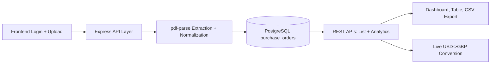

# PO Automation - Full Stack Prototype

This project automates Purchase Order (PO) processing from PDF files into a centralized system with API access, analytics, and dashboard insights.

## 1) Problem Statement

Manual PDF-to-Excel entry is slow and error-prone.  
This prototype replaces manual steps by:

- uploading PO PDFs
- extracting key business fields
- storing normalized data in PostgreSQL
- serving data via APIs
- showing insights in a responsive web dashboard

## 2) End-to-End Workflow

1. User logs in to frontend.
2. Frontend stores auth token and sends it in API headers.
3. User uploads a PO PDF from Upload page.
4. Backend extracts PO fields from PDF text.
5. Cleaned data is saved to `purchase_orders` table.
6. Dashboard and table fetch data via secure APIs.
7. Business insights, filters, timeline, and CSV export become available.

## 3) Tech Stack

### Backend

- Node.js + Express
- PostgreSQL (`pg`)
- Multer (file upload)
- `pdf-parse` (PDF extraction)

### Frontend

- React + TypeScript + Vite
- Material UI
- React Router
- React Query
- Recharts
- Axios

## 4) Core Features Delivered

- Authentication (`/api/auth/login`)
- Protected APIs using Bearer token
- PDF upload + extraction + DB insert
- Filters: date range, supplier, buyer, category
- Purchase Orders table with pagination
- CSV export
- Dashboard insights:
  - total orders
  - total quantity
  - total value (USD)
  - total value (GBP)
  - quantity by supplier
  - value by brand
  - delivery vs confirmed ex-factory timeline
- Live USD to GBP conversion (cached fallback)
- Responsive UI (mobile/tablet/desktop)

## 5) API Summary

- `POST /api/auth/login`
- `POST /api/upload`
- `GET /api/purchase-orders`
- `GET /api/purchase-orders/analytics`

Base URL:

`http://localhost:5000/api`

Auth header:

`Authorization: Bearer dummy-token`

## 6) Project Structure

```text
po-automation/
  backend/
    src/
      config/
      controllers/
      middleware/
      routes/
      services/
      utils/
    .env
    package.json
    server.js
  frontend/
    src/
      api/
      components/
      features/
      hooks/
      pages/
      routes/
      utils/
    public/
    package.json
```

## 7) Setup Instructions

### Backend

```bash
cd backend
npm install
npm run dev
```

Runs on: `http://localhost:5000`

### Frontend

```bash
cd frontend
npm install
npm run dev
```

Runs on: `http://localhost:5173`

## Environment & Security

- Keep real secrets only in local `.env` and deployment env vars.
- Do not commit `.env` or passwords to GitHub.
- Use:
  - `backend/.env.example`
  - `frontend/.env.example`
- Frontend API URL is environment-based:
  - `VITE_API_BASE_URL` (falls back to `http://localhost:5000/api` for local)

## 8) Test Credentials

- Email: `test123@gmail.com`
- Password: `123456`

## 9) How to Test (Demo Steps)

1. Start backend and frontend.
2. Login with test credentials.
3. Upload sample PDF (`frontend/public/sample-po.pdf`).
4. Open Dashboard and verify metrics/charts update.
5. Open Orders Table and apply filters.
6. Click Export CSV and verify file download.

## 10) Architecture Diagram



## 11) Submission Notes

This is a production-style prototype focused on assignment objectives:

- automated PO ingestion
- centralized storage
- API-first design
- analytical dashboard insights
- clear documentation for easy review

Detailed module docs are available in:

- `backend/README.md`
- `frontend/README.md`
