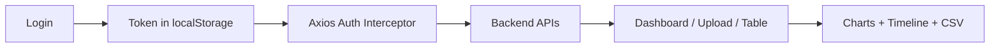

# PO Automation Frontend

Frontend dashboard for automated Purchase Order ingestion and insights.

## 1) Tech Stack

- React + TypeScript + Vite
- Material UI
- React Router
- Axios
- React Query
- Recharts

## 2) Core Features

- Login-based access
- PDF upload UI
- Purchase order table with:
  - pagination
  - filters
  - CSV export
- Interactive dashboard with:
  - total orders/quantity/value
  - supplier quantity chart
  - brand value chart
  - ex-factory vs delivery timeline
  - live USD -> GBP values
- Responsive layout (mobile/tablet/desktop)

## 3) Setup

```bash
cd frontend
npm install
npm run dev
```

Frontend URL: `http://localhost:5173`

Backend API expected at: `http://localhost:5000/api`

Create `.env` from `.env.example` if you need custom API URL:

```env
VITE_API_BASE_URL=http://localhost:5000/api
```

## 4) Login Credentials

- Email: `test123@gmail.com`
- Password: `123456`

## 5) Step-by-Step Usage

1. Start backend and frontend servers.
2. Open app and login.
3. Go to `Upload PDF` and upload a PO PDF.
4. Visit `Dashboard` for insights.
5. Visit `Orders Table` for filtered records and CSV export.

## 6) Filters Available

- Date From
- Date To
- Supplier
- Buyer
- Category
- Apply/Clear actions

## 7) Near Real-Time Behavior

- Dashboard analytics auto-refresh every 15 seconds.
- Updated upload data appears quickly without manual hard refresh.

## 8) Architecture Flow



## 9) Submission Notes (GitHub)

Include these in your submission:

- `backend/README.md`
- `frontend/README.md`
- sample test PDF (`frontend/public/sample-po.pdf`)
- short demo video showing login -> upload -> dashboard -> table flow
